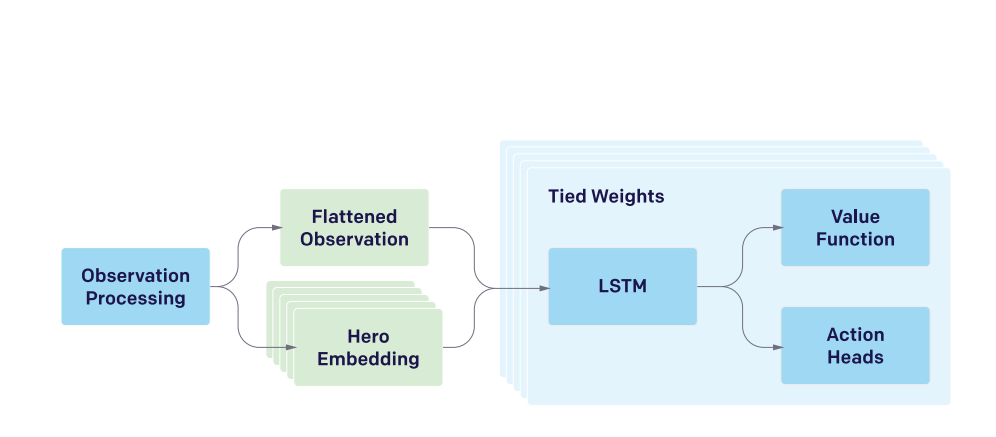
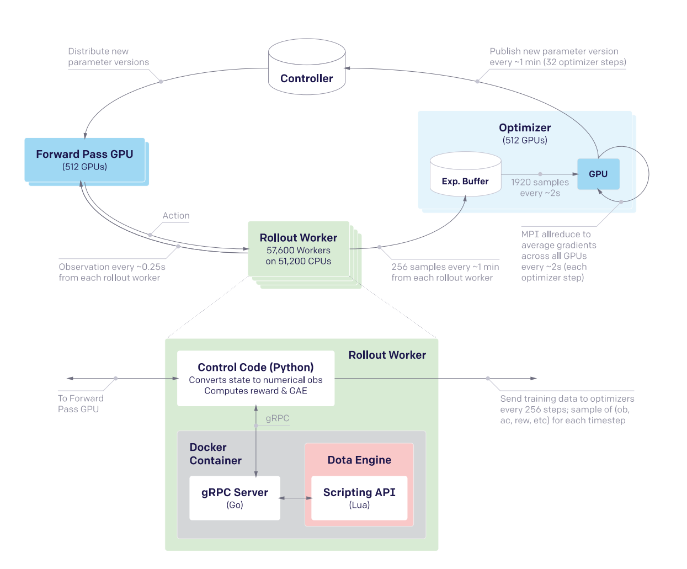

[TOC]

# The difficulty of Dota 2

- **long time horizons** : 每秒30帧，每局游戏大概45分钟，每4帧决策一次，一个episode大概20000个step。
- **Cooperative and Competitive POMDP** : 5 vs 5, 既有合作又有竞争，并且是部分观测的MDP。
- **High-dimensional action and observation spaces** ：观测维度16000维，离散化动作空间，共8000到80000个actions。

# Model Architecture

    
     
    

        simplified model architecture
    

## Observation Space

## Action Space

## Reward Weights

## Neural Network Architecture

# System Architecture

    
     
    

        system architecture
    

## reaction time

    
    

        reaction time
    

- 每4帧决策一次，设决策时刻为$T$, 做出的动作将在$T+1$时刻直行，即$T$时刻执行$T-1$时刻的动作
- 每个动作中有一个维度输出将在接下来的4帧中哪一帧执行此动作。这样延迟在5帧到8帧之间（167ms到267ms)

## opponent sampling 

- 80% 的游戏对手为当前最新版本的参数，20%选择过去的老版本
- 每个过去的对手有一个评估其水平的得分$q_i, i=1,2,\dots,n$, 根据$p_i \sim \exp{(q_i)}$ 采样对手，每10个iteration将当前的智能体加入对手池，得分初始化为最大值。如果当前rollout的game中，当前智能体获胜，则$q_i \leftarrow q_i - \frac{\eta}{Np_i}$ ,若智能体失败，则不更新。

## training algorithm

- **rollout data generation** : Actor 每30秒收集120个time step(每秒4个)的数据送到learner的memory buffer, 然后每一分钟向controller中索要最新的模型参数。
- learner每2秒更新一次参数，这样的话，actor的参数实际上落后learner的参数32个PPO gradient step。

  

