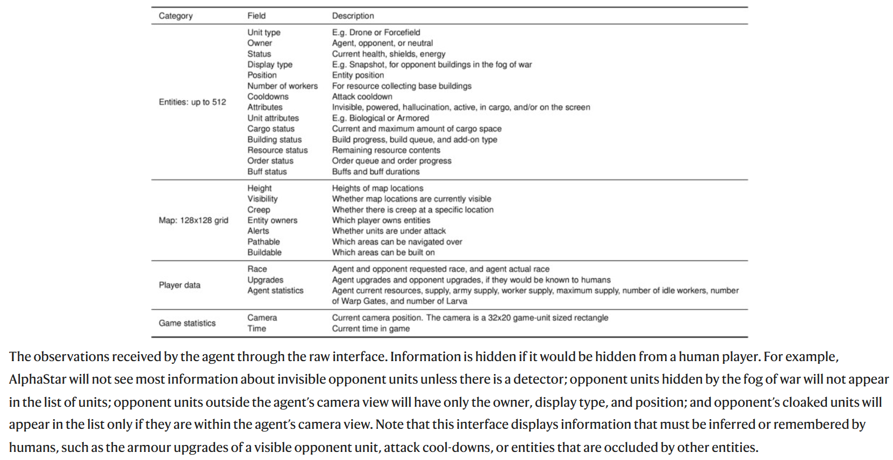
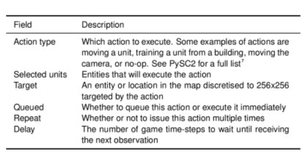

**Grandmaster level in StarCraft II using multi-agent reinforcement learning**

[TOC]

# StarCraft II

- two player zero-sum non-transmissive partial observed game

  [game introduction](https://arxiv.org/abs/1708.04782)

- camera view

  Humans play StarCraft through a screen that displays  only part of the map along with a high-level view of the entire map . The agent interacts with  the game through a similar camera-like interface, which naturally imposes an economy of attention, so that the agent chooses which area  it fully sees and interacts with. The agent can move the camera as an  action.

- APM limits

  Humans are physically limited in the number of actions  per minute (APM) they can execute. Our agent has a monitoring layer  that enforces APM limitations. This introduces an action economy that  requires actions to be prioritized. Agents are limited to executing at  most 22 non-duplicate actions per 5-s window.

- delays

  AlphaStar has two sources of delays. First, in real-time evaluation  (not training), AlphaStar has a delay of about 110 ms between when a  frame is observed and when an action is executed, owing to latency,  observation processing, and inference. Second, because agents  decide ahead of time when to observe next (on average 370 ms,  but possibly multiple seconds), they may react late to unexpected  situations. 

# Model Architecture

    
    

        overview of the architecture
    

## Observation

    

## Action

    
    

        actions. some actions may be ignored, depending on the action type.
    

# Algorithm

## Supervised learning

## Reinforcement learning

### reward

- First, we  initialize the policy parameters to the supervised policy and continually minimize the KL divergence between the supervised and current  policy.
- Second, we train the main agents with pseudo-rewards to  follow a strategy statistic z, which we randomly sample from human  data. These pseudo-rewards measure the edit distance between sampled and executed build orders, and the Hamming distance between  sampled and executed cumulative statistics.
- Each type of pseudo-reward is active (that is,  non-zero) with probability 25%, and separate value functions and losses  are computed for each pseudo-reward

### policy and value update

-  We found that existing off-policy correction methods can be inefficient in large, structured action spaces such as that used  for StarCraft, because distinct actions can result in similar (or even  identical) behavior. We addressed this by using a hybrid approach  that combines off-policy corrections for the policy (which avoids  instability), with an uncorrected update of the value function (which  introduces bias but reduces variance)

- Specifically, the policy is  updated using V-trace and the value estimates are updated using $TD(\lambda)$

- To decrease the variance of  the value estimates, we also use the opponent’s observations as  input to the value functions 

- upgoing policy update (UPGO), which updates the policy parameters in the direction of
  $$
  \rho_{t}\left(G_{t}^{\mathrm{U}}-V_{\theta}\left(s_{t}, z\right)\right) \nabla_{\theta} \log \pi_{\theta}\left(a_{t} \mid s_{t}, z\right)
  $$
  where
  $$
  G_{t}^{\mathrm{U}}= \begin{cases}r_{t}+G_{t+1}^{\mathrm{U}} & \text { if } Q\left(s_{t+1}, a_{t+1}, z\right) \geq V_{\theta}\left(s_{t+1}, z\right) \\ r_{t}+V_{\theta}\left(s_{t+1}, z\right) & \text { otherwise }\end{cases}
  $$
  is an upgoing return, $Q(s_{t+1},a_{t+1},z)$ is an action-value estimate, and $\rho_{t}=\min \left(\frac{\pi_{\theta}\left(a_{t} \mid s_{t}, z\right)}{\pi_{\theta^{\prime}}\left(a_{t} \mid s_{t}, z\right)}, 1\right)$. Owing to the difficulty of approximating $Q(s_{t+1},a_{t+1},z) $over the  large action space of StarCraft, we estimate action-values with a  one-step target, $Q(s_{t+1},a_{t+1},z) = r_t + V_\theta(s_{t+1},z)$.

## Multi-agent learning

- We trained the league using  three main agents (one for each StarCraft race), three main exploiter  agents (one for each race), and six league exploiter agents (two for  each race).

1. **main agents**:
2. **league exploiter agents**: find the global blind spots in league
3. **main exploiter agents**:

