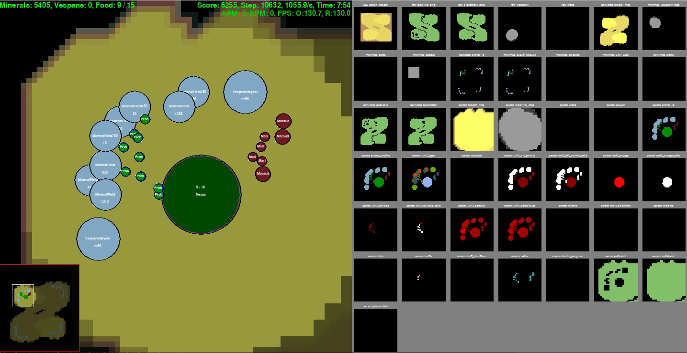
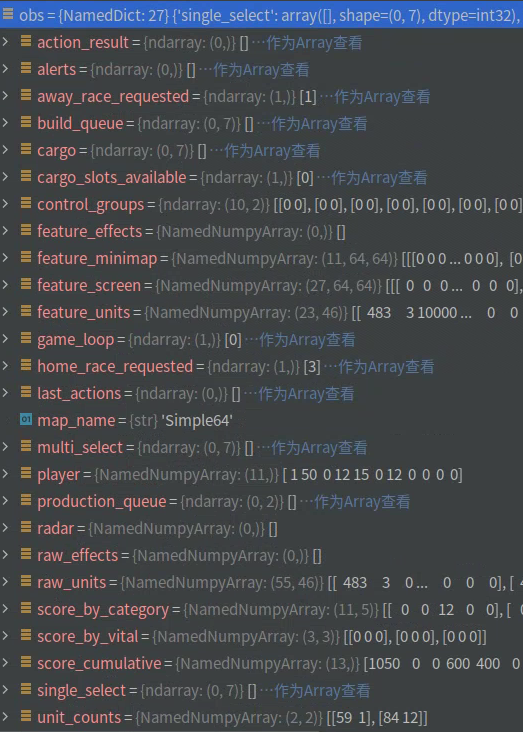
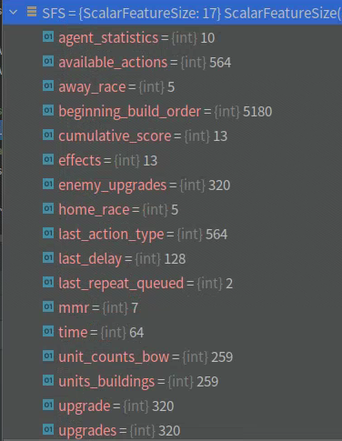
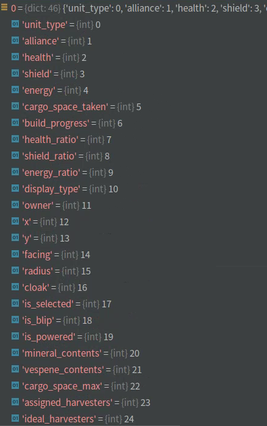
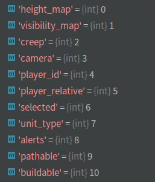
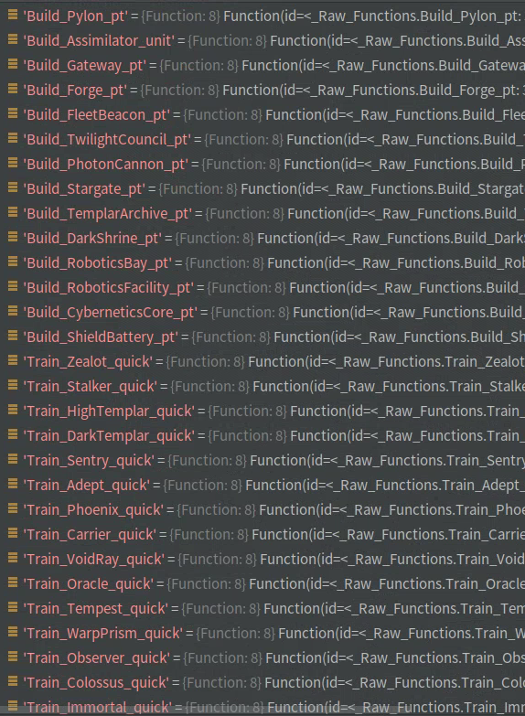
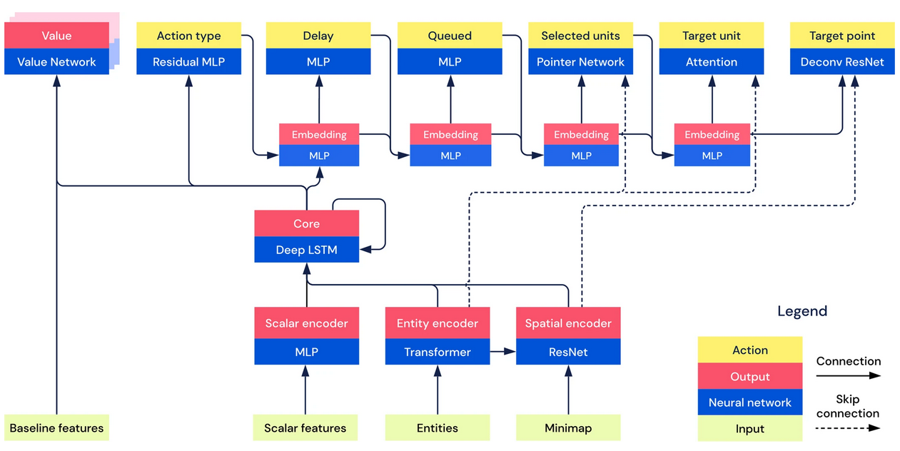
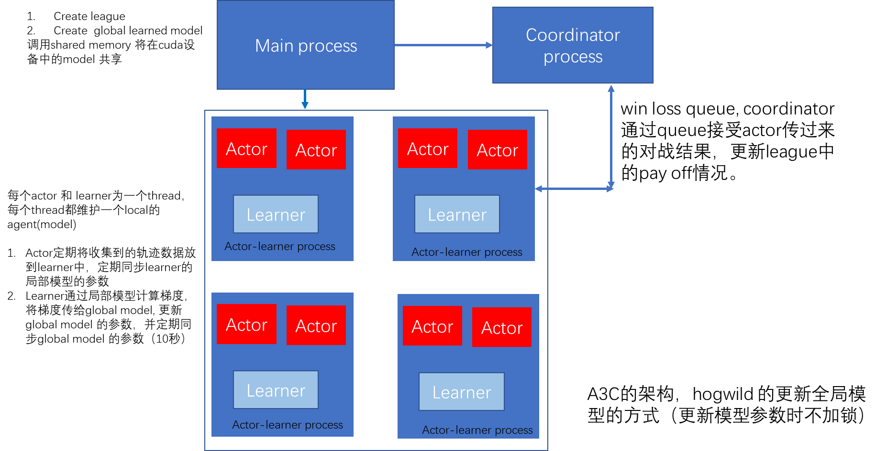

[TOC]

# Idea

**The main component of AlphaStar/ MiniAlphaStar**

1. Preparation and Initialization
   - The definition of observation and action 
   - The architecture of network 
   - Collect training data from replays
   - Train model from supervised learning( behavior cloning)

2. Two-player zero-sum games
   - How to choose an opponent (Priority fictitious self play)
   - RL algorithm (impala upgo and some auxiliary task)
   - Sparse reward ( human pseudo reward)

# Introduction

[暴雪星际争霸开源项目](https://github.com/Blizzard/s2client-proto)提供了不同版本的可以在Linux上运行的游戏引擎，以及人类对战的录像

[deepmind pysc2](https://github.com/deepmind/pysc2)提供了对应的gym风格的api调用

## env introduction

```python
interface = AgentInterfaceFormat(
    Dimensions(64, 64),
    rgb_dimensions=None  # only windows support rgb_dimensions
    )

players = [
    Agent(Race.protoss, 'TestAgent'),
    Bot(Race.terran, Difficulty.easy)
]
with SC2Env(map_name="Simple64", players=players, agent_interface_format=interface, visualize=True, version="4.10.0") as env:
    obs = env.reset()
    while obs[0].step_type != StepType.LAST:
        obs = env.step([FunctionCall(0, [])]) # (action_type, [queue, selected_units, target_units, target location])
```



[video](mAS/intro.mp4)

## miniAlphaStar interface

```Python
interface = AgentInterfaceFormat(
    Dimensions(64, 64),
    rgb_dimensions=None,  # only windows support rgb_dimensions
    use_raw_units=True, #地图上的所有单位的信息，无迷雾
    use_raw_actions=True, #使用定义的函数调用，不是鼠标键盘操作
    use_camera_position=False, #不考虑移动摄像头的操作
    )
```

实际上是blog版本的AlphaStar，早期AlphaStar的版本

## Observation



- 调用env.step得到的observation
- observation有3类属性，分别为scalar feature, entity feature 和 spatial feature

### Scalar Feature



- beginning_build_order reshape 为 20*259，即考虑前20个building的建造顺序

### Entity Feature

observation 的 raw_units 字段， 每个unit的属性如下：



- 最大entity的个数设置为512，将少于512的padding到512, 每个entity的维度为1856

### Spatial Feature

obs.feature_minimap



- 增加4个feature图 表示每个位置是否有unit，最多有4个unit

## action

### action type head

564  action type 



### delay head

delay 表示下一次执行动作要经过多少帧，即delay帧之后才会执行下一个动作，而当前动作是立刻执行的，没有delay的。 delay最大值为128

### queue head

当前动作是否排队

### selected units head

最多选择12个units

### target units head

目标target只有1个

### target location head

目标位置

# Transform replays to data

```python
# build game controller
controllor = build_controller()

for replay_file in replay_files_dir:
    # get replay_info
    replay_info = controller.replay_info(replay_file)
    
    # 如果对战一方为虫族，并且虫族获胜，则提起此数据    
    is_valid = judge_protoss_win(relpay_info)
    if not is_valid:
        continue
    
    #开始播放replays
    env = controller.start_replay(replay_file)
    o, done = env.reset()
    
    obs_list = [o]
    action_list = [function_call("no_op",[])] # action type, [queue, selected_units, target_units, target_location]
    last_delay_list = []
    
    steps = 0
    while not done:
        if o.actions.type != "no_op":
            #将人类的观测o转变为agent的观测obs
            obs_list.append(transform_obs(o))
            action_list.append(o.actions[0]) 
            last_delay_list.append(steps-sum(last_delay_list))
         
         o, done = env.step()
         steps += 1
    
    save(obs_list, action_list, last_delay_list)  
```

details

- 不考虑human interface 的camera move动作
-  每个时刻人类有多个action , 只选择第一个action
- delay的含义为过去delay之后，才执行下一个action, 中间的帧全部no_op

# Supervised Learning

## Model



- mathematic model

$$
p(a|s) = p(a_1,a_2,a_3,a_4,a_5,a_6|s)=p(a_1|s)p(a_2|s,a_1)p(a_3|s,a_1,a_2)p(a_4|s,a_1,a_2,a_3)\cdots
$$


```python
class Model(nn.Module):
    def __init__(self):
        # build encoder
        self.scalar_encoder = ScalarEncoder()
        self.entity_encoder = EntityEncoder()
        self.spatial_encoder = SpatialEncoder()
        
        #lstm core
        self.core = Core()
        
        #build action heads
        self.action_type_head = ActionTypeHead()
        self.delay_head = DelayHead()
        self.queue_head = QueueHead()
        self.selected_units_head = SelectedUnitsHead()
        self.target_unit_head = TargetUnitHead()
        self.location_head = LocationHead()

        # build all baselines
        self.winloss_baseline = Baseline(baseline_type='winloss')
        self.build_order_baseline = Baseline(baseline_type='build_order')
        self.built_units_baseline = Baseline(baseline_type='built_units')
        self.upgrades_baseline = Baseline(baseline_type='upgrades')
        self.effects_baseline = Baseline(baseline_type='effects')  
```

- details 见ppt

## training

```python
model = Model()
optimizer = Adam(model.parameters(), lr=1e-4)

# 对于每个replay 提取到的s1,a1,s2,a2,...,sn,an, 构建长度为4的滑动窗口，即截断长度大于4的序列
dataloader = build_dataloader()

for feature, labels in dataloader:
    # feature: batch_size * 4 * 1056596
    # labels: batch_size * 4* 11446
    state = transform_feature(feature)
    logits = model(state)
    loss = criterion(logits, label)
    optimizer.zero_grad()
    loss.backward()
    optimizer.step()
```

# Evaluate

[video](mAS/eval.mp4)

# RL

- 整体架构为impala/ A3C 算法

  

## Actor

- 随机采样一个replay, 记录replay中的build order, built units, upgrades, effect信息，作为pseudo reward的依据

```python

env = create_env()
obs = env.reset()

while not obs.is_final:
    state = agent.preprocess(obs)
    action_function_call, action, action_logits = agent.model(state)
    
    #计算teacher_logits 为损失的一部分
    teacher_logits = teacher.model(state, action) # 要将action传入，因为计算logit的过程有采样的过程，将采样的过程代替为agent的action
    
    #与环境交互
    next_obs = env.step(action_function_call,step_mul=action.delay) #执行delay步
    
    #得到输赢的稀疏奖励，只有结束的时候才为1，大部分时间为0
    reward = next_obs.reward
    # 也可以通过obs中的cummulative score字段计算一个得分,与采集资源和造兵有关，代替win loss的 sparse reward
    
    #计算agent建造建筑的顺序
    play_bo = calculate(next_obs)
    #此时可以同时开一个replay, 计算人类玩家的build order 两者的编辑距离为奖励
    
    trajectories.append((state, obs, action, action_logits, teacher_logits,player_bo, last_action))
    
    if len(trajectories) >= 8:
        learner.trajectories.append(trajectories)
     
    obs = next_obs
    
    if time_to_sync:
        agent.model.load_state_dict(learner.model.state_dict())

```

## Learner

- **actor loss**: vtrace
- **critic loss**: td lambda (并不重采样，起到正则化的作用)
- **upgo loss**: imitation一个比当前policy更优的策略
- **KL loss**: 与teacher policy 的 KL divergence
- **entropy loss**: 增大当前policy 的 entropy

**notes**: 每个action head单独计算再累加， a-c loss 对5种奖励都计算，upgo loss 只对win loss reward 计算

```python
trajectories: List[List[Tuple]] # traj1, traj2, traj3, 每条轨迹的长度为8

#计算每个state对应action的logits,每个action有六个logits,为action type, delay, queue, select_units, target_unit, target_location
# 每个state有5个baseline, 为winloss, build_order, built_units, upgrades, effects
#每个时刻learner使用的hidden state为action的hidden state
target_logits, baselines = agent.unroll(trajectories) #shape (nums * batch_size * seq_length)

loss =0

for baseline in baselines: #Tensor(batch_size*seq_length)
    #根据trajectories 中存储的人类数据计算每个baseline对应的奖励
    rewards = compute_pseudoreward(trajectories, baseline.name)
    
   
    #计算truncated-td-lambda-loss， lambda = 0.8
    loss_baseline = td_lambda_loss(baseline, rewards)
    loss += loss_baseline
    #计算vtrace loss
    for filed in action_fields: # action_fileds = (type, delay, queue, selected_units, target units, target_location)
        # trajectories 中算出对应field的mask, clipped_ratio 中 c=1
        target_log_prob, clipped_ratio = get_log_prob(target_logits, field, trajectories)
        
        weighted_advantage = vtrace_advantage(clipped_ratio, rewards, baseline)
        
        loss_field = -target_log_prob * weighted_advantage * mask # 可能这个field不存在
        loss += loss_field
  
#Upgo Loss: imitate past good experience 
# G(t) = r(t) + G(t+1) if r(t+1) + V(t+2) > V(t+1) else  r(t) + V(t+1)
# idea: 如果behaviour policy比当前好，使用behaviour policy, 如果 current policy 比 behaviour policy好，使用current policy
# 也就意味着G(t) 可以看成是一个比current policy更好的策略。
# 对每个field 单独求，也要乘clipped ratio。
loss_upgo = sum_upgo_loss(target_logits, trajectories, winloss_baseline, winloss_rewards)

loss += loss_upgo

# KL loss, 每个filed单独求
loss += KL_loss(target_logits, trajectories.teacher_logits)

#entropy loss
loss += entropy_loss(target_logits, trajectories)

#optimize loss
```

### TD $\lambda$

考虑策略$\pi$产生的轨迹$s_0, a_0, r_0, s_1,a_1,r_1,s_2,a_2,r_2,\dots,s_n,a_n,r_n$, 设0时刻$n$-step的值函数$V_0^n$估计为 $r_0 + \gamma r_1 +\gamma^2r_2 + \dots +\gamma^nV_{n}$， 设$\delta_t=r_t+\gamma V_{t+1} - V_t$, 则：
$$
V_0^n - V_0=\sum_{t=0}^{n-1}{\gamma^t\delta_t}
$$
 TD-$\lambda$即对于长度为$n$轨迹，考虑$V_0^1, V_0^2, V_0^3 \dots, V_0^n$整合起来对$V_0$估计，具体来说给$V_0^i$一个权重，正比于$\lambda^i$,即：
$$
\begin{align*}
V_{0}^{td-\lambda} - V_0 &=(1-\lambda)\sum_{i=1}^{n-1}{\lambda^{i-1}V_0^i} + \lambda^{n-1}V_0^n\\
&=(1-\lambda)\sum_{i=1}^{n-1}{\lambda^{i-1}\sum_{t=0}^{i-1}{\gamma^t\delta_t}} + \lambda^{n-1}\sum_{t=0}^{n-1}{\gamma^t\delta_t}\\
&=(1-\lambda)\sum_{t=0}^{n-2}\gamma^t\delta_t\sum_{i=t+1}^{n-1}\lambda^{i-1} + \lambda^{n-1}\sum_{t=0}^{n-1}{\gamma^t\delta_t}\\
&=(1-\lambda)\sum_{t=0}^{n-2}\gamma^t\delta_t\frac{\lambda^{t}(1-\lambda^{n-1-t})}{1-\lambda} + \lambda^{n-1}\sum_{t=0}^{n-1}{\gamma^t\delta_t}\\
&=\sum_{t=0}^{n-2}\gamma^t\delta_t(\lambda^{t}-\lambda^{n-1}) + \lambda^{n-1}\sum_{t=0}^{n-1}{\gamma^t\delta_t}\\
&=\sum_{t=0}^{n-1}\gamma^t\lambda^t\delta_t
 \end{align*}
$$


### Upgo

设当前网络为$\pi_\theta(a|s)$, 值为$V_\theta (s)$,  behavior policy 为$\pi_{b}(a|s)$， 注意behavior policy 可能有多个，不唯一，基于behavior policy产生的trajectories为$s_1,a_1,r_1,s_2,a_2,r_2,\dots,s_n,a_n,r_n$ , UPGO 定义：
$$
G_{t}= 
\begin{cases}
r_{t}+G_{t+1} & \text { if } r_{t+1} + V_\theta(s_{t+2}) > V_\theta(s_{t+1}) 
\\ r_{t}+V_{\theta}\left(s_{t+1}\right) & \text { otherwise}
\end{cases}
$$
并优化
$$
\sum_t{\frac{\pi_{\theta}(a_t|s_t)}{\pi_b(a_t|s_t)}}\cdot(G_t-V_\theta(s_t))\cdot ln\pi_\theta(a_t|s_t)
$$
定义这样一个新的policy:
$$
\pi_{new}(a|s) = \begin{cases} 1 & \text{if }s,a \text{ in trajectories and }Q_\theta(a|s) > V_\theta(s)\\
\pi_\theta(a|s) & \text{otherwise}
\end{cases}
$$
显然，$\pi_{new}$是$\pi_\theta$的一个improvement，并且$Q_{new}(a_t|s_t)  >= E(G_t) $, 所以，$G_t$可以看成是$Q_{new}(a_t|s_t)$一个比较估计。

根据soft q-learning 和 policy gradient 的关系可知，优化
$$
E_{s,a \in \pi_\theta} \left(ln \pi_\theta(a|s)[Q_{new}(a|s)-V_\theta(s)]\right)
$$
等价于优化
$$
E_{s,a\in \pi_\theta}(Q_{new}(a|s) - Q_{\theta}(a|s))
$$


