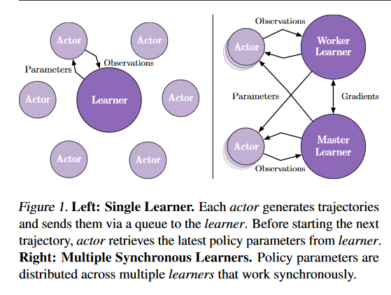
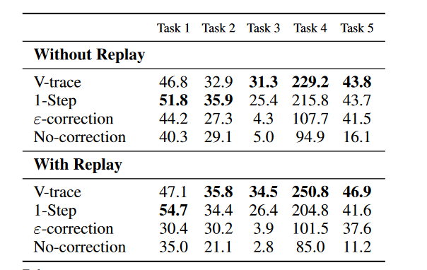

[TOC]

# IMPALA: Scalable Distributed Deep-RL with Importance Weighted Actor-Learner Architectures

## architecture

    
    

        Actor-Learner Architecture
    

- 在actor 产生trajectory之前，actor同步learner的最新的网络参数，然后与环境交互$n$次，之后，将轨迹$x_1,a_1,r_1,\dots,x_n,a_n,r_n,x_{n+1}$与策略$\mu(a_t|x_t)$和初始的LSTM state传给learner。
- learner根据从许多actor中收集到的轨迹数据对策略网络进行参数更新

## V-trace

**goal** : off-policy learning, 使用behaviour policy $\mu$ 产生的轨迹数据学习策略$\pi$的V值

### Naive Importance Sampling

考虑轨迹数据$(x_t,a_t,r_t)_{t=s}^{s+n}\sim \mu$, 则：
$$
\begin{aligned}
V^\pi(x_s)&=E_{a_{t+s} \sim \pi}(\sum_{t=0}^{n}\gamma^{t}r(s_{t+s},a_{t+s}) + \gamma^{n+1}V^\pi(x_{s+n+1}))\\
&=E_{a_{t+s} \sim \pi}(\sum_{t=0}^{n}\gamma^{t}[r(s_{t+s},a_{t+s}) +\gamma V^\pi(x_{t+s+1})-V^\pi(x_{t+s})] + V^\pi(x_s))\\
&=E_{a_{t+s} \sim \pi}(\sum_{t=0}^{n}\gamma^{t}\delta_{t+s} + V^\pi(x_s))\\
\end{aligned}
$$
其中，定义$\delta_{t+s} = r(s_{t+s},a_{t+s}) +\gamma V^\pi(x_{t+s+1})-V^\pi(x_{t+s})$为一步的td-error。

上式可以看出，只需要在$\delta_{t+s}$前加上Importance sampling系数$\rho_t = \prod_{k=0}^{t}\frac{\pi(a_{k+s}|s_{k+s})}{\mu(a_{k+s}|s_{k+s})}$, 即有下式成立：
$$
V^\pi(x_s)=E_{a_{t+s} \sim \mu}(\sum_{t=0}^{n}\gamma^{t}\rho_t\delta_{t+s} + V^\pi(x_s)) \tag{1}
$$
基于此，可以定义算子：
$$
\mathcal{R}V(x)=V(x_0)+E_{a_t \sim \mu}(\sum_{t=0}^{n}\gamma^{t}\rho_t\delta_{t}|x_0=x) \tag{2}
$$
可以证明，此算子为压缩映射，且存在唯一不动点为$V^\pi(x)$。

### V-trace target

Naive的importance sampling存在方差过大的问题，基于采样的方法对方差很敏感，实际效果差。

自然的想法就是对$\rho_t$进行截断，考虑$n=1$的情况，即考虑下式：
$$
RV(x)=V(x_0)+E_{a_0 \sim \mu}\left[min(\frac{\pi(a_0|x_0)}{\mu(a_0|x_0)},\bar{\rho})(r_0+\gamma V(x_1)-V(x_0)) | x_0=x\right]
$$
可以证明，上式为压缩映射，唯一不动点为$V^{\pi_\bar{\rho}}$,其中：
$$
\pi_{\bar{\rho}}(a|x)=\frac{min[\bar{\rho}\mu(a|s),\pi(a|x)]}{\sum_{b \in A}min[\bar{\rho}\mu(a|s),\pi(a|x)]}
$$
由上式可以看出，$\bar{\rho}$是一个方差偏差权衡项，$\bar{\rho}\rightarrow +\infty，\pi_{\bar{\rho}} \rightarrow \pi $ 并且, $\bar{\rho}\rightarrow 0，\pi_{\bar{\rho}} \rightarrow \mu $。

现在考虑$n>1$的情况，将$(2)$式的$\rho_t = \prod_{k=0}^{t}\frac{\pi(a_{k+s}|s_{k+s})}{\mu(a_{k+s}|s_{k+s})}$拆成两部分，即$\rho_t = \prod_{k=0}^{t-1}\frac{\pi(a_{k+s}|s_{k+s})}{\mu(a_{k+s}|s_{k+s})}\cdot\frac{\pi(a_{s+t}|s_{s+t})}{\mu(a_{t+s}|s_{t+s})}$, 第一部分$\prod_{k=0}^{t-1}\frac{\pi(a_{k+s}|s_{k+s})}{\mu(a_{k+s}|s_{k+s})}$表示对当前状态的权重，第二部分表示对$\frac{\pi(a_{s+t}|s_{s+t})}{\mu(a_{t+s}|s_{t+s})}$表示对当前状态td-error估计的权重，根据$n=1$的分析，只要将$\frac{\pi(a_{s+t}|s_{s+t})}{\mu(a_{t+s}|s_{t+s})}$修改为$min(\frac{\pi(a_{s+t}|s_{s+t})}{\mu(a_{t+s}|s_{t+s})},\bar{\rho})$即可，第一部分可以不变，但是为了进一步减小方差，也可取截断。基于此，V-trace operator为：
$$
\mathcal{R} V(x) \stackrel{\text { def }}{=} V(x)+\mathbb{E}_{\mu}\left[\sum_{t \geq 0} \gamma^{t}\left(c_{0} \ldots c_{t-1}\right) \rho_{t}\left(r_{t}+\gamma V\left(x_{t+1}\right)-V\left(x_{t}\right)\right) \mid x_{0}=x, \mu\right]
$$
其中，$\rho_{t}=\min \left(\bar{\rho}, \frac{\pi\left(a_{t} \mid x_{t}\right)}{\mu\left(a_{t} \mid x_{t}\right)}\right)$, $c_{t}=\min \left(\bar{c}, \frac{\pi\left(a_{t} \mid x_{t}\right)}{\mu\left(a_{t} \mid x_{t}\right)}\right)$,并且要满足$\bar{\rho} \ge \bar{c}$。

## Actor-Critic Algorithm

由于采用截断重要性采样的方式其实是评估$\pi_{\bar{\rho}}$的值函数，所以对于$\pi_{\bar{\rho}}$的策略梯度(忽略state distribution)为：
$$
E_{a\sim\mu(\cdot|x)}[\frac{\pi_{\bar{\rho}}(a|x)}{\mu(a|x)}\nabla\log\pi_\bar{\rho}(a|x)(r_s+\gamma V^{\pi_\bar{\rho}}(x')-V^{\pi_\bar{\rho}}(x))]
$$
假设$\pi_{\bar{\rho}}$与$\pi_{\rho}$差别不大，那么可以认为优化$\pi_{\bar{\rho}}$就是在优化$\pi_\rho$,则可以得到一个off-policy的ac算法为：

1. 初始化参数$\theta$,则值函数和策略函数可表示为$ V_\theta,\pi_\theta$
2. actor同步learner的参数并采样
3. learner根据数据进行学习，学习分两步：
   - $\theta \rightarrow \theta - \eta(\mathcal{R}V_\theta(x)-V_\theta(x))\nabla_\theta V_\theta(x)$
   - $\theta \rightarrow \theta + \eta\rho_t\nabla\log\pi_\theta(a|x)(r+\gamma v(s') - V_\theta(x))$

## Experiments

    
     
    

        消融实验验证off-policy ac的有效性，并通过replay buffer进一步增大行为分布和目标分布的差异
    

## Conclusion

- 本质就是对naive importance sampling取截断，通过增大偏差的方式减少方差

- 设计算法的时候本质还是忽略了偏差

